20231002_MiniDataAnalysis2
================
Torin
2023-10-22

*To complete this milestone, you can either edit [this `.rmd`
file](https://raw.githubusercontent.com/UBC-STAT/stat545.stat.ubc.ca/master/content/mini-project/mini-project-2.Rmd)
directly. Fill in the sections that are commented out with
`<!--- start your work here--->`. When you are done, make sure to knit
to an `.md` file by changing the output in the YAML header to
`github_document`, before submitting a tagged release on canvas.*

# Welcome to the rest of your mini data analysis project!

In Milestone 1, you explored your data. and came up with research
questions. This time, we will finish up our mini data analysis and
obtain results for your data by:

-   Making summary tables and graphs
-   Manipulating special data types in R: factors and/or dates and
    times.
-   Fitting a model object to your data, and extract a result.
-   Reading and writing data as separate files.

We will also explore more in depth the concept of *tidy data.*

**NOTE**: The main purpose of the mini data analysis is to integrate
what you learn in class in an analysis. Although each milestone provides
a framework for you to conduct your analysis, it’s possible that you
might find the instructions too rigid for your data set. If this is the
case, you may deviate from the instructions – just make sure you’re
demonstrating a wide range of tools and techniques taught in this class.

# Instructions

**To complete this milestone**, edit [this very `.Rmd`
file](https://raw.githubusercontent.com/UBC-STAT/stat545.stat.ubc.ca/master/content/mini-project/mini-project-2.Rmd)
directly. Fill in the sections that are tagged with
`<!--- start your work here--->`.

**To submit this milestone**, make sure to knit this `.Rmd` file to an
`.md` file by changing the YAML output settings from
`output: html_document` to `output: github_document`. Commit and push
all of your work to your mini-analysis GitHub repository, and tag a
release on GitHub. Then, submit a link to your tagged release on canvas.

**Points**: This milestone is worth 50 points: 45 for your analysis, and
5 for overall reproducibility, cleanliness, and coherence of the Github
submission.

**Research Questions**: In Milestone 1, you chose two research questions
to focus on. Wherever realistic, your work in this milestone should
relate to these research questions whenever we ask for justification
behind your work. In the case that some tasks in this milestone don’t
align well with one of your research questions, feel free to discuss
your results in the context of a different research question.

# Learning Objectives

By the end of this milestone, you should:

-   Understand what *tidy* data is, and how to create it using `tidyr`.
-   Generate a reproducible and clear report using R Markdown.
-   Manipulating special data types in R: factors and/or dates and
    times.
-   Fitting a model object to your data, and extract a result.
-   Reading and writing data as separate files.

# Setup

Begin by loading your data and the tidyverse package below:

``` r
library(datateachr) # <- might contain the data you picked!
library(tidyverse)
```

    ## Warning: package 'ggplot2' was built under R version 4.2.3

    ## Warning: package 'tibble' was built under R version 4.2.3

    ## Warning: package 'tidyr' was built under R version 4.2.3

    ## Warning: package 'purrr' was built under R version 4.2.3

    ## Warning: package 'dplyr' was built under R version 4.2.3

    ## Warning: package 'stringr' was built under R version 4.2.3

# Task 1: Process and summarize your data

From milestone 1, you should have an idea of the basic structure of your
dataset (e.g. number of rows and columns, class types, etc.). Here, we
will start investigating your data more in-depth using various data
manipulation functions.

### 1.1 (1 point)

First, write out the 4 research questions you defined in milestone 1
were. This will guide your work through milestone 2:

<!-------------------------- Start your work below ---------------------------->

1.  I would like to continue to explore whether ‘M’ and ‘B’ differ in
    other characteristics, such as symmetry, smoothness etc.

2.  What is the relationship between size and compactness?

3.  Is the fractal dimension associated with any other variable?

4.  What is the largest and smallest tumour in the ‘B’ and ‘M’ groups
    based on radius? (modified from original question for simplicity)
    <!----------------------------------------------------------------------------->

Here, we will investigate your data using various data manipulation and
graphing functions.

### 1.2 (8 points)

Now, for each of your four research questions, choose one task from
options 1-4 (summarizing), and one other task from 4-8 (graphing). You
should have 2 tasks done for each research question (8 total). Make sure
it makes sense to do them! (e.g. don’t use a numerical variables for a
task that needs a categorical variable.). Comment on why each task helps
(or doesn’t!) answer the corresponding research question.

Ensure that the output of each operation is printed!

Also make sure that you’re using dplyr and ggplot2 rather than base R.
Outside of this project, you may find that you prefer using base R
functions for certain tasks, and that’s just fine! But part of this
project is for you to practice the tools we learned in class, which is
dplyr and ggplot2.

**Summarizing:**

1.  Compute the *range*, *mean*, and *two other summary statistics* of
    **one numerical variable** across the groups of **one categorical
    variable** from your data.
2.  Compute the number of observations for at least one of your
    categorical variables. Do not use the function `table()`!
3.  Create a categorical variable with 3 or more groups from an existing
    numerical variable. You can use this new variable in the other
    tasks! *An example: age in years into “child, teen, adult, senior”.*
4.  Compute the proportion and counts in each category of one
    categorical variable across the groups of another categorical
    variable from your data. Do not use the function `table()`!

**Graphing:**

5.  Create a graph of your choosing, make one of the axes logarithmic,
    and format the axes labels so that they are “pretty” or easier to
    read.
6.  Make a graph where it makes sense to customize the alpha
    transparency.

Using variables and/or tables you made in one of the “Summarizing”
tasks:

7.  Create a graph that has at least two geom layers.
8.  Create 3 histograms, with each histogram having different sized
    bins. Pick the “best” one and explain why it is the best.

Make sure it’s clear what research question you are doing each operation
for!

<!------------------------- Start your work below ----------------------------->

# Research Question (RQ) 1

## Do ‘M’ and ‘B’ tumours differ in other characteristics such as symmetry, smoothness, etc?

*I will begin by looking at differences in symmmetry between ‘B’ and ‘M’
tumours.*

2.  Compute the number of observations for at least one of your
    categorical variables. Do not use the function `table()`!

``` r
#This code will compute the number of observations in each category of the 'diagnosis' variable.
cancer_sample %>%
  group_by(diagnosis) %>%
  count(diagnosis)
```

    ## # A tibble: 2 × 2
    ## # Groups:   diagnosis [2]
    ##   diagnosis     n
    ##   <chr>     <int>
    ## 1 B           357
    ## 2 M           212

``` r
#This information gives us insight into the balance of sample sizes between the 'B' and 'M' groups, guiding further analyses to answer RQ1 regarding differences in the symmetry of 'B' and 'M' tumours.
```

8.  Create 3 histograms, with each histogram having different sized
    bins. Pick the “best” one and explain why it is the best.

``` r
#The following code will create histograms of symmetry, with 10, 40 or 300 bins, for both the 'B' and 'M' groups.
library(ggridges)
```

    ## Warning: package 'ggridges' was built under R version 4.2.3

``` r
for (i in c(10, 40, 300)) {
  histo <- ggplot(cancer_sample) + 
  geom_density_ridges(mapping = aes(x = symmetry_mean, y = diagnosis), stat = "binline", bins = i, scale = 0.95, draw_baseline = FALSE)
  print(histo)
}
```

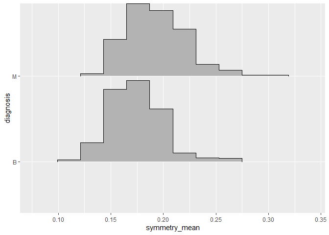<!-- -->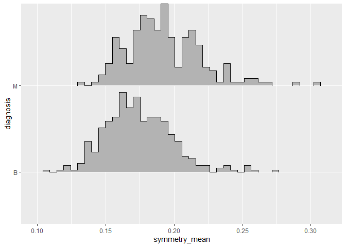<!-- -->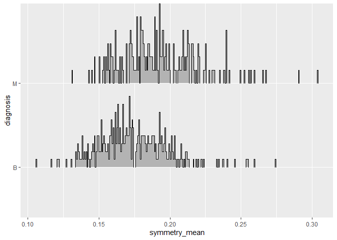<!-- -->

``` r
#From this code, we can see that 10 bins is too broad to capture the subtle differences between groups in this dataset with 569 observations. Meanwhile, the 300-bin histogram is too 'noisy', allowing outliers to disproportionately impact the impression of the data. However, the 40-bin histogram seems to work well, with enough granularity to distinguish differences between the 'M' and 'B' groups, while still simplifying an otherwise busy dataset. 
#This provides insight into RQ1, suggesting that tumours in the 'M' group are more symmetric than those in the 'B' group, which was not as clear from the summary statistics table alone. 
```

\#RQ2 \## What is the relationship between tumour size and compactness?

3.  Create a categorical variable with 3 or more groups from an existing
    numerical variable. You can use this new variable in the other
    tasks! *An example: age in years into “child, teen, adult, senior”.*

``` r
#The following code will divide tumour radius into large, medium and small groups, creating a new categorical variable 'radius_cat' and bringing it near the front of the table.
cancer_sample1 <- cancer_sample %>%
  mutate(radius_cat = case_when(radius_mean < 10 ~ "Very Small",
                                radius_mean < 15 ~ "Small",
                                radius_mean < 20 ~ "Intermediate",
                                TRUE ~ "Large")) %>%
  select(ID, diagnosis, radius_mean, radius_cat, everything())
cancer_sample1
```

    ## # A tibble: 569 × 33
    ##        ID diagnosis radius_mean radius_cat texture_mean perimeter_mean area_mean
    ##     <dbl> <chr>           <dbl> <chr>             <dbl>          <dbl>     <dbl>
    ##  1 8.42e5 M                18.0 Intermedi…         10.4          123.      1001 
    ##  2 8.43e5 M                20.6 Large              17.8          133.      1326 
    ##  3 8.43e7 M                19.7 Intermedi…         21.2          130       1203 
    ##  4 8.43e7 M                11.4 Small              20.4           77.6      386.
    ##  5 8.44e7 M                20.3 Large              14.3          135.      1297 
    ##  6 8.44e5 M                12.4 Small              15.7           82.6      477.
    ##  7 8.44e5 M                18.2 Intermedi…         20.0          120.      1040 
    ##  8 8.45e7 M                13.7 Small              20.8           90.2      578.
    ##  9 8.45e5 M                13   Small              21.8           87.5      520.
    ## 10 8.45e7 M                12.5 Small              24.0           84.0      476.
    ## # ℹ 559 more rows
    ## # ℹ 26 more variables: smoothness_mean <dbl>, compactness_mean <dbl>,
    ## #   concavity_mean <dbl>, concave_points_mean <dbl>, symmetry_mean <dbl>,
    ## #   fractal_dimension_mean <dbl>, radius_se <dbl>, texture_se <dbl>,
    ## #   perimeter_se <dbl>, area_se <dbl>, smoothness_se <dbl>,
    ## #   compactness_se <dbl>, concavity_se <dbl>, concave_points_se <dbl>,
    ## #   symmetry_se <dbl>, fractal_dimension_se <dbl>, radius_worst <dbl>, …

``` r
#This breaks the radius down into digestible size categories, making the numeric data easier to interpret in subsequent comparisons with compactness.
```

7.  Create a graph that has at least two geom layers.

``` r
#The following code will create boxplots of tumour compactness, showing the median and interquartile range, for each tumour size category. A second geom layer, a jitter plot, will be overlaid on the histogram and will visualize differences in the compactness distribution between 'B' and 'M' tumours using different colours.
ggplot(cancer_sample1, aes(x = factor(radius_cat, levels = c("Very Small", "Small", "Intermediate", "Large")), y = compactness_mean)) + 
  geom_boxplot(outlier.colour = NULL, outlier.shape = NA, alpha = 0.33) + 
  geom_jitter(aes(colour = diagnosis), alpha = 0.33) +
  labs(x = "Tumour Radius", y = "Tumour Compactness") + 
  theme_classic()
```

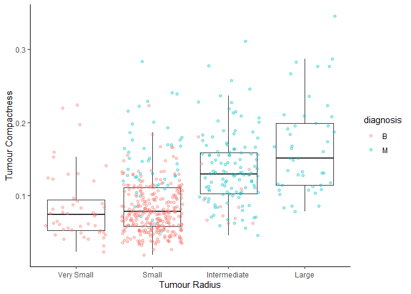<!-- -->

``` r
#Based on these results, there is a clear trend of increasing compactness with larger radius category, and we can see that most of the larger tumours are in the 'M' category. 
```

\#RQ3 \##Is the fractal dimension associated with any other variable?

1.  Compute the *range*, *mean*, and *two other summary statistics* of
    **one numerical variable** across the groups of **one categorical
    variable** from your data.

``` r
#The following code will compute the range, mean, median and standard deviation for the fractal dimension across the 'B' and 'M' groups of the diagnosis variable.
fractals <- cancer_sample1 %>%
  group_by(diagnosis) %>%
  summarize(min = min(fractal_dimension_mean), max = max(fractal_dimension_mean), mean = mean(fractal_dimension_mean), median = median(fractal_dimension_mean), standarddeviation = sd(fractal_dimension_mean))

fractals
```

    ## # A tibble: 2 × 6
    ##   diagnosis    min    max   mean median standarddeviation
    ##   <chr>      <dbl>  <dbl>  <dbl>  <dbl>             <dbl>
    ## 1 B         0.0518 0.0958 0.0629 0.0615           0.00675
    ## 2 M         0.0500 0.0974 0.0627 0.0616           0.00757

``` r
#This gives us an idea of the the parameters and scope of the fractal dimension variable, setting the stage to explore its relationships with other variables through graphing.
```

5.  Create a graph of your choosing, make one of the axes logarithmic,
    and format the axes labels so that they are “pretty” or easier to
    read.

``` r
#The following code will create scatterplots of each 'mean' variable in the table against the mean fractal dimension, to visualize and explore potential relationships between the fractal dimension and other variables. 
#start by defining a function to create the desired scatterplot, based on retrieval of columns by subsetting
fn <- function(z) {
  ggplot() +
  geom_point(mapping = aes(x = cancer_sample[[z]], y = cancer_sample$fractal_dimension_mean)) +
  labs(x = paste0(colnames(cancer_sample)[z]), y = "fractal_dimension_mean") +
    theme_classic()
}

#next, loop over the columns containing 'mean' variables in the table, applying the function to each column to produce the corresponding plot
for (i in 3:11) {
  plot <- fn(i)
  print(plot)
}
```

<!-- -->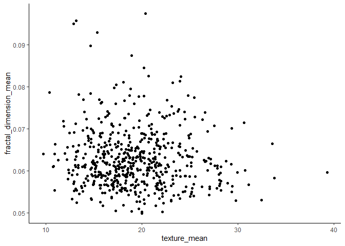<!-- -->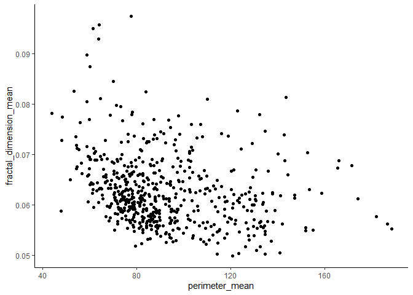<!-- -->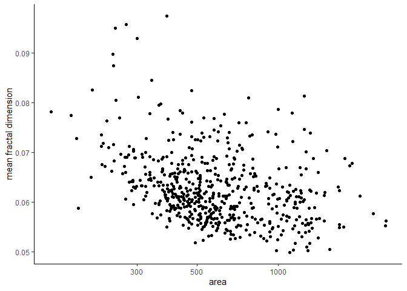<!-- -->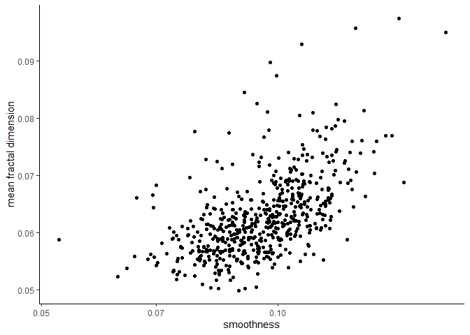<!-- -->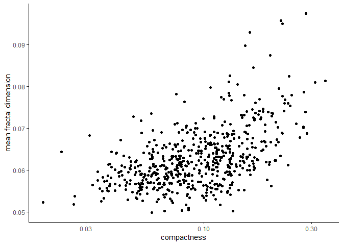<!-- --><!-- -->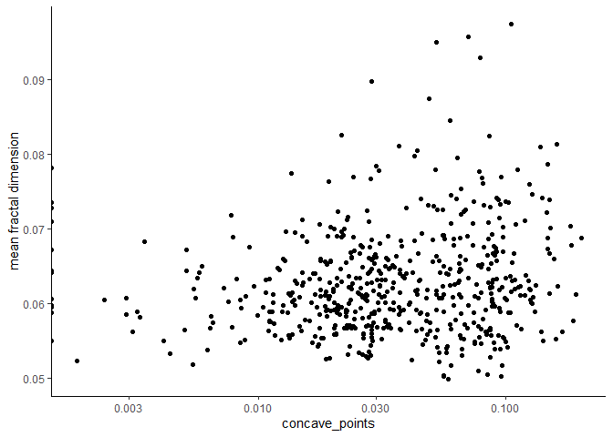<!-- -->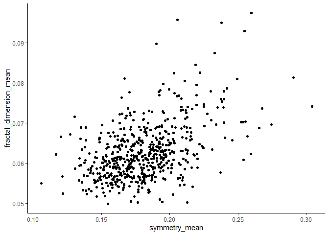<!-- -->

``` r
#from these plots, most variables do not appear to have a strong association with the mean fractal dimension. However, smoothness, compactness and symmetry seem to be somewhat positively associated, while measures of size appear negatively associated.
```

\#RQ4 \##4. What is the largest and smallest tumour in the ‘B’ and ‘M’
groups based on radius?

1.  Compute the *range*, *mean*, and *two other summary statistics* of
    **one numerical variable** across the groups of **one categorical
    variable** from your data.

``` r
#The following code will compute the range, mean, median and standard deviation of the tumour radius across the 'B' and 'M' groups of the diagnosis variable.
cancer_sample1 %>%
  group_by(diagnosis) %>%
  summarize(min = min(radius_mean), max = max(radius_mean), mean = mean(radius_mean), median = median(radius_mean), standarddeviation = sd(radius_mean))
```

    ## # A tibble: 2 × 6
    ##   diagnosis   min   max  mean median standarddeviation
    ##   <chr>     <dbl> <dbl> <dbl>  <dbl>             <dbl>
    ## 1 B          6.98  17.8  12.1   12.2              1.78
    ## 2 M         11.0   28.1  17.5   17.3              3.20

``` r
#This table answers RQ4, telling us the measurements of the smallest and largest tumours in each group.
```

6.  Make a graph where it makes sense to customize the alpha
    transparency.

``` r
#The following code will create jitterplots of the radius for the 'B' and 'M' groups, showing the smallest observation in each group as a dark point to allow this observation to stand out.
#filter out only the min and max observations to highlight
highlight <- cancer_sample1 %>%
  group_by(diagnosis) %>%
  filter(radius_mean == max(radius_mean) | radius_mean == min(radius_mean))

#exclude the min and max values from the `rest` of the observations in order to avoid duplicate points with different positions due to jitter
rest <- cancer_sample1 %>%
  group_by(diagnosis) %>%
  filter(radius_mean != max(radius_mean) & radius_mean != min(radius_mean))

#create jitter plots
ggplot(cancer_sample1, aes(x = diagnosis, y = radius_mean)) +
  geom_jitter(data = rest, alpha = 0.1, height = 0) +
  geom_jitter(data = highlight, alpha = 1, height = 0) +
  theme_classic()
```

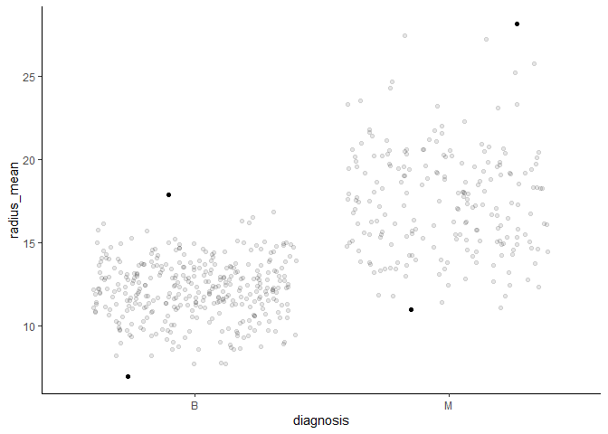<!-- -->
<!----------------------------------------------------------------------------->

### 1.3 (2 points)

Based on the operations that you’ve completed, how much closer are you
to answering your research questions? Think about what aspects of your
research questions remain unclear. Can your research questions be
refined, now that you’ve investigated your data a bit more? Which
research questions are yielding interesting results?

<!------------------------- Write your answer here ---------------------------->

Based on these preliminary investigations, I have made significant
progress toward understanding my initial questions. I have shown that
‘B’ and ‘M’ tumours differ substantially in their symmetry, defined a
positive diagnosis-dependent association between tumour size and
compactness, discovered several variables with apparent relationships to
fractal dimension, and identified the largest and smallest tumours in
each diagnosis group. Although these trends are quite clear in most
cases, we are limited in our understanding of their significance, as we
have not conducted formal statistical analyses. This could be a
potential next step in refining these questions and confirming results.
In my view, the most interesting results came from comparing the ‘B’ and
‘M’ groups across various characteristics. It will be useful to continue
to group observations by the diagnosis in future analyses to further
investigate these trends.
<!----------------------------------------------------------------------------->

# Task 2: Tidy your data

In this task, we will do several exercises to reshape our data. The goal
here is to understand how to do this reshaping with the `tidyr` package.

A reminder of the definition of *tidy* data:

-   Each row is an **observation**
-   Each column is a **variable**
-   Each cell is a **value**

### 2.1 (2 points)

Based on the definition above, can you identify if your data is tidy or
untidy? Go through all your columns, or if you have \>8 variables, just
pick 8, and explain whether the data is untidy or tidy.

<!--------------------------- Start your work below --------------------------->

The cancer_sample dataset is tidy. Each row is one observation, each
column is a variable, and each cell is a value. There are no variables
listed as values, and no values are listed as variables. Each
observation only appears as one row, without duplication.
<!----------------------------------------------------------------------------->

### 2.2 (4 points)

Now, if your data is tidy, untidy it! Then, tidy it back to it’s
original state.

If your data is untidy, then tidy it! Then, untidy it back to it’s
original state.

Be sure to explain your reasoning for this task. Show us the “before”
and “after”.

<!--------------------------- Start your work below --------------------------->

``` r
#This code will untidy the dataset by converting the two values of the diagnosis variable into new, separate variables, with values taken from 'radius_mean'.
untidy_data <- cancer_sample %>%
  pivot_wider(names_from = diagnosis, values_from = radius_mean) %>%
  select(ID, M, B, everything())

untidy_data
```

    ## # A tibble: 569 × 32
    ##          ID     M     B texture_mean perimeter_mean area_mean smoothness_mean
    ##       <dbl> <dbl> <dbl>        <dbl>          <dbl>     <dbl>           <dbl>
    ##  1   842302  18.0    NA         10.4          123.      1001           0.118 
    ##  2   842517  20.6    NA         17.8          133.      1326           0.0847
    ##  3 84300903  19.7    NA         21.2          130       1203           0.110 
    ##  4 84348301  11.4    NA         20.4           77.6      386.          0.142 
    ##  5 84358402  20.3    NA         14.3          135.      1297           0.100 
    ##  6   843786  12.4    NA         15.7           82.6      477.          0.128 
    ##  7   844359  18.2    NA         20.0          120.      1040           0.0946
    ##  8 84458202  13.7    NA         20.8           90.2      578.          0.119 
    ##  9   844981  13      NA         21.8           87.5      520.          0.127 
    ## 10 84501001  12.5    NA         24.0           84.0      476.          0.119 
    ## # ℹ 559 more rows
    ## # ℹ 25 more variables: compactness_mean <dbl>, concavity_mean <dbl>,
    ## #   concave_points_mean <dbl>, symmetry_mean <dbl>,
    ## #   fractal_dimension_mean <dbl>, radius_se <dbl>, texture_se <dbl>,
    ## #   perimeter_se <dbl>, area_se <dbl>, smoothness_se <dbl>,
    ## #   compactness_se <dbl>, concavity_se <dbl>, concave_points_se <dbl>,
    ## #   symmetry_se <dbl>, fractal_dimension_se <dbl>, radius_worst <dbl>, …

``` r
#Next, we will convert the untidy dataset back to tidy format by resetting the 'M' and 'B' categories back to variables, and sending their values back to 'radius_mean'.
retidied_data <- untidy_data %>%
  pivot_longer(c(M, B), names_to = "diagnosis", values_to = "radius_mean", values_drop_na = TRUE) %>%
  select(ID, diagnosis, radius_mean, everything())

retidied_data
```

    ## # A tibble: 569 × 32
    ##          ID diagnosis radius_mean texture_mean perimeter_mean area_mean
    ##       <dbl> <chr>           <dbl>        <dbl>          <dbl>     <dbl>
    ##  1   842302 M                18.0         10.4          123.      1001 
    ##  2   842517 M                20.6         17.8          133.      1326 
    ##  3 84300903 M                19.7         21.2          130       1203 
    ##  4 84348301 M                11.4         20.4           77.6      386.
    ##  5 84358402 M                20.3         14.3          135.      1297 
    ##  6   843786 M                12.4         15.7           82.6      477.
    ##  7   844359 M                18.2         20.0          120.      1040 
    ##  8 84458202 M                13.7         20.8           90.2      578.
    ##  9   844981 M                13           21.8           87.5      520.
    ## 10 84501001 M                12.5         24.0           84.0      476.
    ## # ℹ 559 more rows
    ## # ℹ 26 more variables: smoothness_mean <dbl>, compactness_mean <dbl>,
    ## #   concavity_mean <dbl>, concave_points_mean <dbl>, symmetry_mean <dbl>,
    ## #   fractal_dimension_mean <dbl>, radius_se <dbl>, texture_se <dbl>,
    ## #   perimeter_se <dbl>, area_se <dbl>, smoothness_se <dbl>,
    ## #   compactness_se <dbl>, concavity_se <dbl>, concave_points_se <dbl>,
    ## #   symmetry_se <dbl>, fractal_dimension_se <dbl>, radius_worst <dbl>, …

<!----------------------------------------------------------------------------->

### 2.3 (4 points)

Now, you should be more familiar with your data, and also have made
progress in answering your research questions. Based on your interest,
and your analyses, pick 2 of the 4 research questions to continue your
analysis in the remaining tasks:

<!-------------------------- Start your work below ---------------------------->

1.  I would like to continue to explore whether ‘M’ and ‘B’ differ in
    other characteristics, such as symmetry, smoothness etc.

2.  Is the fractal dimension associated with any other variable?

<!----------------------------------------------------------------------------->

Explain your decision for choosing the above two research questions.

<!--------------------------- Start your work below --------------------------->

I selected RQ1 because we explored differences in symmetry between ‘M’
and ‘B’ tumours earlier, but we did not have a chance to look at many
other variables in detail between these two groups. I also selected RQ2
because although the plots created earlier give us a rough idea of
relationships between the fractal dimension and other variables, there
are many other ways to identify potential relationships (e.g., summary
statistics, different types of plots, etc), that we could still
potentially explore.
<!----------------------------------------------------------------------------->

Now, try to choose a version of your data that you think will be
appropriate to answer these 2 questions. Use between 4 and 8 functions
that we’ve covered so far (i.e. by filtering, cleaning, tidy’ing,
dropping irrelevant columns, etc.).

(If it makes more sense, then you can make/pick two versions of your
data, one for each research question.)

<!--------------------------- Start your work below --------------------------->

``` r
#This code will simplify the data by selecting only the 'mean' variables (ignoring the 'best', 'worst' and 'se' variables which are irrelevant to the research questions). Then, we will check for and remove observations with missing IDs or diagnoses, shorten the name of each variable to faciliate graph labels, and arrange the observations in ascending order of ID.
cancer_sample2 <- cancer_sample1 %>%
  select(ID:fractal_dimension_mean) %>%
  filter(ID != "NA" & diagnosis != "NA") %>%
  rename("radius" = radius_mean, "texture" = texture_mean, "perimetre" = perimeter_mean, "area" = area_mean, "smoothness" = smoothness_mean, "compactness" = compactness_mean, "concavity" = concavity_mean, "concave_points" = concave_points_mean, "symmetry" = symmetry_mean, "fractal_dimension" = fractal_dimension_mean) %>%
  arrange(ID)

cancer_sample2
```

    ## # A tibble: 569 × 13
    ##       ID diagnosis radius radius_cat   texture perimetre  area smoothness
    ##    <dbl> <chr>      <dbl> <chr>          <dbl>     <dbl> <dbl>      <dbl>
    ##  1  8670 M           15.5 Intermediate    19.5     102.   749.     0.109 
    ##  2  8913 B           12.9 Small           13.1      81.9  516.     0.0696
    ##  3  8915 B           15.0 Small           19.1      97.0  687.     0.0899
    ##  4  9047 B           12.9 Small           16.2      83.2  508.     0.0988
    ##  5 85715 M           13.2 Small           18.7      86.0  535.     0.116 
    ##  6 86208 M           20.3 Large           23.0     132.  1264      0.0908
    ##  7 86211 B           12.2 Small           17.8      77.8  451.     0.104 
    ##  8 86355 M           22.3 Large           19.7     153.  1509      0.133 
    ##  9 86408 B           12.6 Small           20.8      82.2  480.     0.0993
    ## 10 86409 B           14.3 Small           19.6      97.8  630.     0.0784
    ## # ℹ 559 more rows
    ## # ℹ 5 more variables: compactness <dbl>, concavity <dbl>, concave_points <dbl>,
    ## #   symmetry <dbl>, fractal_dimension <dbl>

<!----------------------------------------------------------------------------->

# Task 3: Modelling

## 3.0 (no points)

Pick a research question from 1.2, and pick a variable of interest
(we’ll call it “Y”) that’s relevant to the research question. Indicate
these.

<!-------------------------- Start your work below ---------------------------->

**Research Question**:

1.  I would like to continue to explore whether ‘M’ and ‘B’ differ in
    other characteristics, such as symmetry, smoothness etc.

**Variable of interest**: texture

<!----------------------------------------------------------------------------->

## 3.1 (3 points)

Fit a model or run a hypothesis test that provides insight on this
variable with respect to the research question. Store the model object
as a variable, and print its output to screen. We’ll omit having to
justify your choice, because we don’t expect you to know about model
specifics in STAT 545.

-   **Note**: It’s OK if you don’t know how these models/tests work.
    Here are some examples of things you can do here, but the sky’s the
    limit.

    -   You could fit a model that makes predictions on Y using another
        variable, by using the `lm()` function.
    -   You could test whether the mean of Y equals 0 using `t.test()`,
        or maybe the mean across two groups are different using
        `t.test()`, or maybe the mean across multiple groups are
        different using `anova()` (you may have to pivot your data for
        the latter two).
    -   You could use `lm()` to test for significance of regression
        coefficients.

<!-------------------------- Start your work below ---------------------------->

``` r
#This code will perform a two-sample t-test to evaluate the difference in texture between the 'M' and 'B' diagnosis groups.
cancer_sample3 <- cancer_sample2 %>%
  pivot_wider(names_from = diagnosis, values_from = texture)

ttest <- t.test(cancer_sample3$M, y = cancer_sample3$B)

ttest
```

    ## 
    ##  Welch Two Sample t-test
    ## 
    ## data:  cancer_sample3$M and cancer_sample3$B
    ## t = 11.022, df = 463.07, p-value < 2.2e-16
    ## alternative hypothesis: true difference in means is not equal to 0
    ## 95 percent confidence interval:
    ##  3.032237 4.348050
    ## sample estimates:
    ## mean of x mean of y 
    ##  21.60491  17.91476

``` r
#We reject the null hypothesis that the two means are equal, concluding that the 'M' tumours have a significantly higher texture measurement than 'B' tumours.
```

<!----------------------------------------------------------------------------->

## 3.2 (3 points)

Produce something relevant from your fitted model: either predictions on
Y, or a single value like a regression coefficient or a p-value.

-   Be sure to indicate in writing what you chose to produce.
-   Your code should either output a tibble (in which case you should
    indicate the column that contains the thing you’re looking for), or
    the thing you’re looking for itself.
-   Obtain your results using the `broom` package if possible. If your
    model is not compatible with the broom function you’re needing, then
    you can obtain your results by some other means, but first indicate
    which broom function is not compatible.

<!-------------------------- Start your work below ---------------------------->

``` r
#Using the broom::tidy() function, we can provide a summary table of the results of our two-sample t-test. Specifically, we are interested in the p-value, which here is less than an alpha threshold of 0.05, allowing us to confidently reject the null hypothesis.
broom::tidy(ttest)
```

    ## # A tibble: 1 × 10
    ##   estimate estimate1 estimate2 statistic  p.value parameter conf.low conf.high
    ##      <dbl>     <dbl>     <dbl>     <dbl>    <dbl>     <dbl>    <dbl>     <dbl>
    ## 1     3.69      21.6      17.9      11.0 3.02e-25      463.     3.03      4.35
    ## # ℹ 2 more variables: method <chr>, alternative <chr>

<!----------------------------------------------------------------------------->

# Task 4: Reading and writing data

Get set up for this exercise by making a folder called `output` in the
top level of your project folder / repository. You’ll be saving things
there.

## 4.1 (3 points)

Take a summary table that you made from Task 1, and write it as a csv
file in your `output` folder. Use the `here::here()` function.

-   **Robustness criteria**: You should be able to move your Mini
    Project repository / project folder to some other location on your
    computer, or move this very Rmd file to another location within your
    project repository / folder, and your code should still work.
-   **Reproducibility criteria**: You should be able to delete the csv
    file, and remake it simply by knitting this Rmd file.

<!-------------------------- Start your work below ---------------------------->

``` r
#The following code writes the table 'fractals' (created earlier) to a csv in the folder 'output' using the 'here()' function.
library(here)
```

    ## Warning: package 'here' was built under R version 4.2.3

    ## here() starts at C:/Users/Torin/OneDrive - UBC/Documents/STAT545A/mda-torinhalvorson/mda-torinhalvorson

``` r
library(readr)
here::here()
```

    ## [1] "C:/Users/Torin/OneDrive - UBC/Documents/STAT545A/mda-torinhalvorson/mda-torinhalvorson"

``` r
write_csv(fractals, path = here::here("output", "fractals.csv"))
```

    ## Warning: The `path` argument of `write_csv()` is deprecated as of readr 1.4.0.
    ## ℹ Please use the `file` argument instead.
    ## This warning is displayed once every 8 hours.
    ## Call `lifecycle::last_lifecycle_warnings()` to see where this warning was
    ## generated.

<!----------------------------------------------------------------------------->

## 4.2 (3 points)

Write your model object from Task 3 to an R binary file (an RDS), and
load it again. Be sure to save the binary file in your `output` folder.
Use the functions `saveRDS()` and `readRDS()`.

-   The same robustness and reproducibility criteria as in 4.1 apply
    here.

<!-------------------------- Start your work below ---------------------------->

``` r
here::here()
```

    ## [1] "C:/Users/Torin/OneDrive - UBC/Documents/STAT545A/mda-torinhalvorson/mda-torinhalvorson"

``` r
write_rds(fractals, path = here::here("output", "fractals.rds"))
```

    ## Warning: The `path` argument of `write_rds()` is deprecated as of readr 1.4.0.
    ## ℹ Please use the `file` argument instead.
    ## This warning is displayed once every 8 hours.
    ## Call `lifecycle::last_lifecycle_warnings()` to see where this warning was
    ## generated.

<!----------------------------------------------------------------------------->

# Overall Reproducibility/Cleanliness/Coherence Checklist

Here are the criteria we’re looking for.

## Coherence (0.5 points)

The document should read sensibly from top to bottom, with no major
continuity errors.

The README file should still satisfy the criteria from the last
milestone, i.e. it has been updated to match the changes to the
repository made in this milestone.

## File and folder structure (1 points)

You should have at least three folders in the top level of your
repository: one for each milestone, and one output folder. If there are
any other folders, these are explained in the main README.

Each milestone document is contained in its respective folder, and
nowhere else.

Every level-1 folder (that is, the ones stored in the top level, like
“Milestone1” and “output”) has a `README` file, explaining in a sentence
or two what is in the folder, in plain language (it’s enough to say
something like “This folder contains the source for Milestone 1”).

## Output (1 point)

All output is recent and relevant:

-   All Rmd files have been `knit`ted to their output md files.
-   All knitted md files are viewable without errors on Github. Examples
    of errors: Missing plots, “Sorry about that, but we can’t show files
    that are this big right now” messages, error messages from broken R
    code
-   All of these output files are up-to-date – that is, they haven’t
    fallen behind after the source (Rmd) files have been updated.
-   There should be no relic output files. For example, if you were
    knitting an Rmd to html, but then changed the output to be only a
    markdown file, then the html file is a relic and should be deleted.

Our recommendation: delete all output files, and re-knit each
milestone’s Rmd file, so that everything is up to date and relevant.

## Tagged release (0.5 point)

You’ve tagged a release for Milestone 2.

### Attribution

Thanks to Victor Yuan for mostly putting this together.
